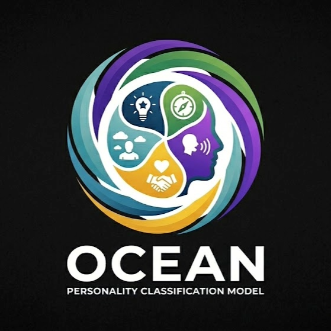

#  Big Five Personality Classification Model

A machine learning project to classify human personality traits based on the **Big Five (OCEAN) model** using questionnaire data.

---
<p align="center">
  
</p>
##  Overview

This project aims to build a personality prediction system that classifies individuals into five major personality traits:

- **O** – Openness  
- **C** – Conscientiousness  
- **E** – Extraversion  
- **A** – Agreeableness  
- **N** – Neuroticism  

The model is trained on responses from a Big Five personality dataset and uses machine learning techniques to predict personality traits.

---

##  Dataset

- Source: Big Five Personality Dataset (Tunguz / Kaggle)
- Contains questionnaire responses (BFI – Big Five Inventory)
- Includes multiple features representing personality-related questions

---

##  Trained Model

The trained personality classification model can be accessed here:

👉 [Download / View Model](https://drive.google.com/file/d/147fRf_8RMiTzt-R3FGqSpPzuGVsvVss8/view?usp=drive_link)

> This is the main trained model used for personality prediction.

---

## ⚙️ Tech Stack

- **Programming Language:** Python  
- **Libraries Used:**
  - Pandas  
  - NumPy  
  - Scikit-learn  
  - Matplotlib  
  - Seaborn  

---

## 🔍 Project Workflow

1. **Data Collection**
   - Load dataset
   - Understand structure and features

2. **Data Preprocessing**
   - Handle missing values
   - Encode/clean data
   - Normalize if required

3. **Exploratory Data Analysis (EDA)**
   - Analyze distributions
   - Correlation between traits

4. **Feature Engineering**
   - Group questions into OCEAN traits
   - Generate meaningful inputs

5. **Model Building**
   - Train ML models (e.g., Logistic Regression, Random Forest)
   - Multi-label or regression-based prediction

6. **Evaluation**
   - Accuracy / F1-score
   - Confusion matrix

---

## 🚀 How to Run

```bash
# Clone the repository
git clone https://github.com/upayanchakraborty/Big-Five-Personality-Classification-Model-.git

# Navigate to project folder
cd Big-Five-Personality-Classification-Model-

# Install dependencies
pip install -r requirements.txt

# Run the script
python main.py
